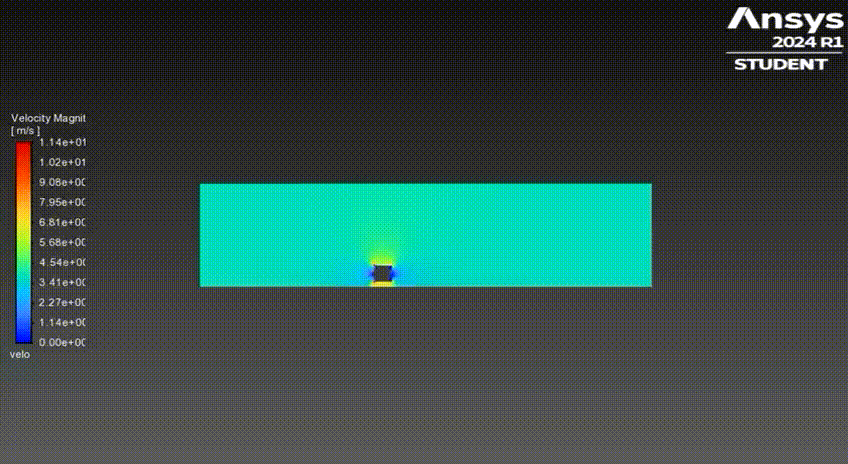

# Building_Vortex_Shedding_Analysis
Analyzes vortex shedding &amp; wind loads on Ping An Finance Center via ANSYS Fluent. 2D model, 417k-element mesh, k-omega SST, PISO solver. Flow at 15-25 m/s yields ~0.04 Hz vortex frequency, ~2.4 drag coefficient. Uses CFD. Aligns with aerodynamic research.
This project investigates vortex shedding and wind load effects on the Ping An Finance Center using ANSYS Fluent. A 2D model with a 417,414-element mesh, k-omega SST turbulence model, and PISO solver was used to study flow at 15-25 m/s. Results show a ~0.04 Hz vortex frequency and ~2.4 drag coefficient, validated via FFT.

## Objective
Analyze vortex shedding and wind loads on a high-rise building to ensure structural stability.

## Methodology
- **Geometry**: 2D model of Ping An Finance Center.
- **Mesh**: 417,414 elements, multizone quad/tri mesh.
- **Solver**: Transient simulation with k-omega SST model.
- **Parameters**:
  - Reynolds Number: 45,468,750 (turbulent flow).
  - Strouhal Number: 0.15.
  - Vortex Shedding Frequency: ~0.045 Hz.
- **Software**: ANSYS Fluent, (for FFT).

### Vortex Shedding Animation

> This was the first trial of my vortex shedding analysis. Since there was no symmetry in the setup, I re-centered the building in the domain and repeated the simulation.

## Mesh
- [Meshed Structure](meshed_structure.png)  
  *417,414 elements, multizone quad/tri mesh.*
- [Close Mesh](close_mesh.png)  
  *Detailed view of mesh structure.*

## Results
- **Drag Coefficient**: ~2.4.
- **Vortex Shedding Frequency**: ~0.04 Hz.
- **Velocity Contours**:
  - [Velocity Contour 15 m/s](velocity_contour_15ms.png)
  - [Velocity Contour 20 m/s](velocity_contour_20ms.png)
  - [Velocity Contour 25 m/s](velocity_contour_25ms.png)
- **FFT Analysis**:
  - [FFT 15 m/s](fft_15ms.png)
  - [FFT_20_m/s](fft_20ms.png)
  - [FFT_25_m/s](fft_25ms.png)

## Report
- [Full Report](vortex_shed.pdf)

## Technologies
- ANSYS Fluent
- DesignModeler
